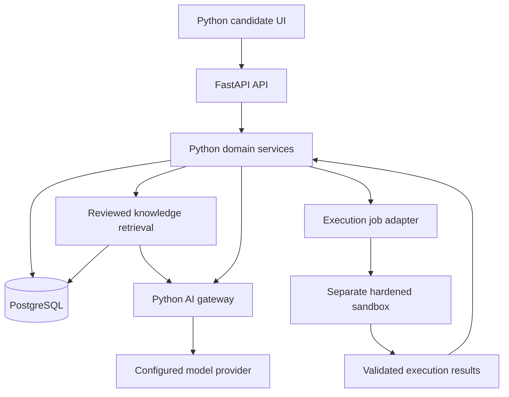

# Python architecture

## Product boundary

Begin with a modular Python application, one persistent database and clearly isolated candidate-code execution. The model generates teaching and interview language; deterministic services own permissions, timing, evidence, scores and progression.

## Planned components

| Component | Initial design | Decision boundary |
| --- | --- | --- |
| Candidate and admin UI | Python-authored Streamlit prototype | Phase 1 must validate navigation, session handling and accessible forms; strict browser telemetry is deferred |
| API | FastAPI with typed request and response schemas | Authentication and resource ownership enforced on every protected request |
| Domain services | Plain Python modules | Roadmap constraints, scoring, progression and retention are independently testable |
| Persistence | PostgreSQL, SQLAlchemy and Alembic | Database is the source of truth; migrations version all schema changes |
| Retrieval | PostgreSQL full-text baseline; pgvector when semantic retrieval is added | Filter source approval, region, role and freshness before generation |
| Background jobs | Python worker; Redis queue when asynchronous workloads require it | Bounded retries and idempotent completion prevent duplicate effects |
| AI gateway | Provider-neutral Python interface | Validated response schemas, prompt versions, timeouts, budgets and trace IDs |
| Agent runtime | Deep Agents SDK on LangGraph | Multi-step coaching, specialist delegation, durable state, streaming and human review |
| Code runner | External hardened execution service behind a Python adapter | Never run submitted Python inside the UI, API or ordinary worker process |
| Reports | Python generation from immutable evidence snapshots | Phase 5; numerical values come from stored calculations |

These are planned choices, not installed dependencies or claims of a production-ready stack. Resolve compatible versions, lock them and review official documentation during implementation.

See the [GenAI and machine learning architecture](GENAI_ARCHITECTURE.md) for the agent team, RAG path, personalization models and evaluation gates.

The Python-only requirement applies to authored application code. Browser internals and infrastructure can use their own runtimes. If a strict editor, fullscreen or focus-event requirement cannot be met by the chosen Python UI without custom JavaScript, record that as a scope decision before Phase 3. Do not silently introduce a TypeScript frontend or claim complete browser proctoring.

## Request flows



Company answers use approved, applicable and current source chunks. Citations must resolve to supporting stored content. Missing, conflicting or stale evidence produces an abstention or an explicit limitation. Retrieved text, uploaded content and candidate code are untrusted data and cannot override application rules.

Practice submissions produce immutable code snapshots and asynchronous job IDs. Sample runs and hidden-test submissions have different access rules. The API validates runner results and stores objective test outcomes before requesting AI feedback. Provider failure leaves deterministic results usable.

## Planned package boundaries

```text
src/interviewforge/
  api/            # routes, authentication dependencies, schema validation
  domain/         # deterministic rules and interfaces
  services/       # use cases and orchestration
  persistence/    # database models and repositories
  ai/             # provider adapter, retrieval, prompt policies
  execution/      # external sandbox client and job validation
  ui/             # Python-authored user and admin screens
  workers/        # ingestion and background job entry points
tests/
  unit/
  integration/
  evals/
```

This tree describes future modules; empty placeholder implementations are not counted as delivery.

## Data design

- Identity: User, CandidateProfile, TargetPlan, Company and Role. Every candidate-owned record has an enforceable owner relationship.
- Content: Topic, Problem, Hint, TestCase, SourceRecord, KnowledgeItem and KnowledgeVersion. Store licensing, verification date, review deadline, approval state and company/role/region applicability.
- Learning: DiagnosticSession, DiagnosticResponse, RoadmapVersion, RoadmapTask, PracticeAttempt, ExecutionJob, TopicMastery and RevisionItem. Preserve input evidence and policy versions.
- AI: TutorSession, TutorMessage and AITrace, with model and prompt versions, retrieved source IDs, latency and usage. Redact unnecessary personal data.
- Later assessments: AssessmentBlueprint, AssessmentSession, AssessmentSubmission, IntegrityEvent, ScoreSnapshot and UnlockRecord.
- Later interviews and analytics: InterviewSession, InterviewMessage, RubricEvidence, JourneyStageState, ReadinessSnapshot and ReportSnapshot.

Use UTC for persisted timestamps and the candidate timezone for daily plans. Prefer stable identifiers, constraints, explicit indexes and transaction boundaries. Completed assessments and reports reference frozen policy/content versions so recalculation is auditable.

## Controls and operations

Secrets are configured outside Git and never returned to UI clients. Protected queries enforce ownership; admin publication is role-controlled and audited. Separate hidden tests from candidate-visible representations. Rate-limit generation and execution; limit input/output sizes and redact logs.

Sandbox infrastructure must deny outbound network access, constrain CPU/memory/time/process count, prevent host filesystem access and clean up each job. A basic container alone is not sufficient evidence of safe isolation. Phase 2 cannot enable public code submission until execution limits and abuse cases have been tested.

Define retention by data category and support deletion of derived embeddings, conversations, exports and reports. Camera and keystroke capture are off by default and excluded from Phases 1 and 2. Later integrity events require explicit consent and must not become automatic cheating verdicts.

Measure API errors/latency, queue delay, execution failures, retrieval quality, abstentions and AI token usage. Health/readiness checks, backup restore and graceful provider outages are release gates appropriate to each phase.
